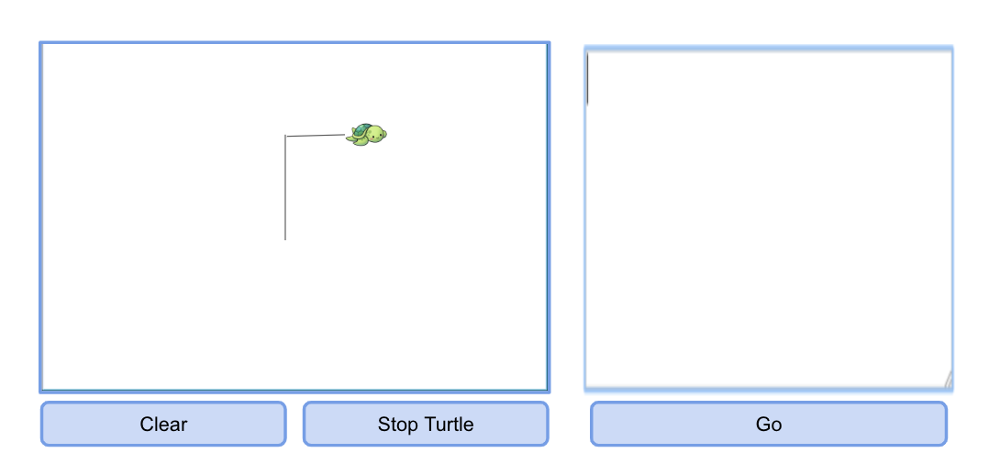

##Introduction

The problem we are trying to solve by writing this project is to help beginner programmers learn about the workflow command structure of programming. We will do this by creating a program which can take in written text commands and functions that the user inputs. Our program will parse these commands to move a GUI turtle to draw a picture according to what the user inputted. The primary design of our program with be according to an MVC design with the goal of being the most flexible in terms of the Model and View ends. The View should be expandable in terms of being able to added different things the user can input beyond just text (Perhaps buttons/new developer states). The Model will be designed to be able to account for additional commands, states and types of functions the user can input. We envision that the Controller which connects the Model to the View will be the least flexible part of the program in that we want it to, for the most part, always adhere to the same flows of execution. It will however be flexible in terms of types of instructions and the things it will connect to in the View. In terms of primary architecture, we plan to use two external API’s to specify how the View and Model (ViewAPI and ModelAPI) interact with the Controller. In terms of our code being open for extension but closed for modification, we plan to have many subclasses for both our View and Model classes which can be expanded upon as we continue to add more features. Our code will be closed to modification of the basic necessities of the program: frontend will always have a textfield, turtle and drawing canvas while the backend will always have instructions which implement the instruction interface. Our code will be open for modification in that it will be easy to add new frontend features by creating new objects and it will be easy to add new backend instructions or functions by creating new classes that extend the InstructionAPI. At a high level, the user will input code into a textfield in the frontend. Once they press a go button, the controller will be activated and will grab the input text then ask the backend to parse the String input. The controller will then ask the backend to create a list of states based on the instruction parsed. The controller will then use those states to update the display of the front end and the user will see the effect their inputted code had on the drawing canvas on the front end. 

##Overview 

External backend API: Model

The purpose of this API is to allow a Controller to interact with the backend model, specifically in regards to getting a List of States from passing the backend the raw instruction it receives from the frontend. This will then allow the Controller to pass these states to a frontend to display the changes.

Functions 
* List<State> executeCode(String input): allow a model to execute an instruction and return a List of States
* void clearVars(): allows a Controller to clear all variables when a program ends so that they do not persist to the next program being run

Two Different Implementations of this API
1. A backend that uses the executeCode() method as specified, via parsing and executing the instruction and passing back a List of States.
2. A backend that uses the executeCode() method differently, such as a backend that simply needs to store the instructions that are given by the String input.


External frontend API: View

The purpose of this API is to allow a Controller to interact with the frontend, specifically in terms of getting the instruction typed in by the user as a raw String and passing in the next state to be displayed by the frontend UI.

Functions 
* String getInstruction(): allow a UI to return the instruction as a raw String that is typed in by the user
* void updateDisplay(State nextState): allow a UI to update its display given the next State
* void showError(String errorMessage): allow a UI to update its display by showing an error

Two different implementations of this API
1. A frontend that uses these methods as specified in order to return an instruction or update its display.
2. A frontend that takes in the instruction but has a different implementation of updateDisplay, say, displaying the next state’s attribute values instead of moving the Turtle.

Internal backend API: Instruction

The purpose of this API is to allow different instructions to be easily added. It acts as an interface that requires any instruction to have an execute function.

Functions
* List<State> execute(State currentState, List<Variable> vars): allow an instruction to be executed given an initial state and return either the next state or a List of future states.
* List<String> getNeededVarNames()

Two different implementations of this API

1. The forwardInstruction’s execute method would simply take the current state and a distance and use some trigonometry to find the next x and y position. It then returns a list of one State: the one with the updated x and y.
2. The forLoopInstruction’s execute method would just go through and execute each of its contained Instructions until the end condition is satisfied.

Internal frontend API: ActionButton
The purpose of this API is to allow different buttons to be easily added. It acts as an interface that requires any new button to have an execute() method

Functions

* execute(): according to whether the button is “go” “clear” or “stop turtle,” this method will perform the required action 

Two different implementations of this API
1. The Clear button’s execute function would go through all of the elements being shown on the screen and sets their visibility to false
2. The Go button’s execute function would communicate to the Controller that the Model should start parsing instructions


##User Interface

We plan to have a simple interface. The interface will include a large text input field for the user to write commands, a “go” button for the user to press when they have inputted their command and a large screen which displays the outcome of the user input. The canvas, which we will call the DrawingCanvas, will have a GUI turtle which holds the drawing pen. This turtle will move about the screen according to the commands the user inputs. Below the screen, we will include a “clear screen” button which will clear all of the drawings currently on the screen. Foreshadowing that the user will write an infinite loop, we also hope to include a “stop turtle” button which will stop the movement of the turtle and perhaps clear our the previous instruction. We envision that the complete will include having more means of input than just the text field, so we are making out frontend design flexible for extension. We will make all of the buttons, Turtle, textfield and DrawingCanvas exist as separate objects that the Visual can access. Thus, to create new features in the future, we will just have to create new objects to represent those. 



We intend for the user to be given feedback if they input code that is not recognized by the parser. When the user inputs incorrect commands, there will be a text message that appears and indicates their code was not correct. We are unsure, as of now, how in depth we will be able to go with the error messages. It would be great to be able to give more personal feedback to the instruction typed, for example, if they just missed a brace or had incorrect capitalization. 

##Design Details
This section describes each API introduced in the Overview in detail (as well as any other sub-components that may be needed but are not significant to include in a high-level description of the program). Describe how each API supports specific features given in the assignment specification, what resources it might use, how it is intended to be used, and how it could be extended to include additional requirements (from the assignment specification or discussed by your team). Finally, justify the decision to create each class introduced with respect to the design's key goals, principles, and abstractions. This section should go into as much detail as necessary to cover all your team wants to say.
Our overall design is used a Display that is in charge of showing the user the result of their commands and taking their inputs, a Model which parses the string and decides how the turtle will move based on the instructions, and a Controller which facilitates communication between them. More details are given on this design below:
	
Controller

* The controller will have a listener that activates whenever the go button is activated
* When the go button is pressed, it will activate its main method
* Takes instruction(s) as a string from the front end and passes it to the back end
* Takes a list of States from the back end and passes it one at a time to the front end

Model
* Takes in a long string of possible instructions
* Goes through them one at a time and interprets them, creating a list of Instructions
* All instructions are implementations of the Instructions API
* For loops and while loops are also implementations of the Instructions API
* After creating a list of Instructions,  it loops through that list and creates a list of States
* It returns this list of States to the controller
* All variables that are created during this second loop will be stored in a list of variables and updated used throughout the duration of the loop

Display

* The display extends application and handles all the input from the user
* The display has methods for loading a new file, as well as stopping, and starting the turtle
* The display also has a method which updates the display when told to do so from the Controller. This method takes a State and then updates the view accordingly 

Instruction API

* The instruction API has one method: execute. All implementations of Instruction have to have a version of this.
* Execute takes in a current State and returns a list of States.
* Most instruction types will return a list with only a single State, but some instructions like loops will need to return more

State
* This class holds the current state of everything in the simulation, all information that would be needed to update the display every step of the program
* The State would not need to hold any of the variables because they are not needed for updating the state
* It would hold the current position and rotation of the turtle, a boolean holding whether the pen is up, and the current RGB hex code of the pen color


##API as Code

###Instruction API
```
public interface Instruction {

    List<State> execute(State currentState, List<Variable> vars);
    List<String> getNeededVarNames();
}
```

###Model API
```
public interface Model {

    List<State> executeCode(String rawCode);
}
```

###View API
```
public interface View {

    String getInstruction() throws NullPointerException;
    void updateDisplay(State nextState);
    void showError(String errorMessage);
}
```

###Button API
```
public interface Button {

    void execute();
}
```

##Design Considerations

The first issue we encountered when designing this project was how we were going to update the DrawingCanvas on the Visual screen from the Controller class. Ideally, we want the Controller class to do all of the stepping and updating. However, due to the nature of javafx, we have to have our step() method in the frontend Visual class. To address this, we envision that the step() method of the Visual class simply calls the go() method within the Controller class which is the real looping method which uses instructions to update the turtle state. The downside to this design is that we would need an instance of the Controller in the frontend, but we could address this by making the go() method the only public method in the Controller. As an alternate design, we heard from a little bird that an ActionListener object could be useful in this scenario. The ActionListener would wait for the “go” button to be pressed and this would activate the Controller go() method. In this way, we would not have infinite stepping and we would know the exact time when to begin reading and moving. 

We have also encountered the problem with how our backend will deal with instruction which affect variables in the Visual. For example, one instruction changes the color of the turtle’s pen. Instead of just changing the location of the turtle, more attributes about the Turtle need to change. Right now, to deal with commands, we have a state object which includes an x and y position, a boolean indicating whether the pen is up or down and a angle direction which the turtle is facing. For this extra attribute, we plan to add a new attribute to state which is the color of the pen. However, this could be problematic if new commands are introduced. We cannot just keep adding new attributes to state as our number of known commands grows. For now, this will be a viable solution but in the future, we might need to think of a more flexible way to address new variables introduced through commands. 

We also have not fully fleshed out how the Visual will be updated from the controller. Right now, our pseudo code includes a single line which writes myViewAPI.update(State s). This will call a method defined  in the visual API called update() which exists in the Visual class. By doing this, we do not have to pass our Turtle between the Controller and Visual classes, thus eliminating a fatal dependency. However, this limits us to all changes made on the frontend are encompassed in the State object. This problem connects to our previous issue. We do not know as of now if more variables will be needed to be adjusted than double x,y position, boolean penUp, Color pen and double angle. This this list significantly grows then we might consider creating a StateAPI which different ColorState, PositionState and PenState classes all implement. 

Right now, our Controller seems to be the least complex part of the project. The job fo the Controller is to just communicate the work between the front and backends. We forsee that having so much work being done by the backend could create problems in the future. If we are handling all conditionals, instructions, functions, parsing and math in the backend, will we run into problems with our design becoming too complex? Should we find a way to give the Controller more work? Right now, our design intuitively makes sense to completely separate all logic from the Controller, but we could run into problems that the backend is doing too much and must be broken up. 

##Team Responsibilities

The program is broken up according to the MVC model and thus our particular team responsibilities are also broken up in this way. Juliet and Braeden will be focusing on the front end. They will be in charge of creating a Turtle, Textfield, DrawingCanvas and buttons which give input to the backend and can be updated by the controller. Charles and Michael will focus on constructing a backend which is able to parse, create instructions and develop a list of changing states for those instructions. Natalie will focus on the Controller and connecting the backend information to updates on the front end. We all agree, however, that our domains of coding are not strictly limited to these roles. If someone needs help, or if someone has finished early, it will be expected that people can move around to apply themselves to the different parts. Thus, everyone is expected to understand the high-level work flow and how data moves through the entire project. To complete the project, we plan to meet as a team early in the week for the beginning programming steps and fleshing out which requires everyone to be in close proximity to each other. Once we have the workflow fleshed out, then we can start to work on our own to define and code the details to the parts we are assigned. We hope to finish before the weekend so we can spend the weekend incorporating all of the final aspects and confirming that we have hit all the requirements of the Basic. 

#Use Cases
The user types 'fd 50' in the command window, and sees the turtle move in the display window leaving a trail, and the command is added to the environment's history.
1. User types fd50
2. Go button clicked
3. Listener in controller has listener for go button - when clicked, calls view.getInstr()
4. Calls model.executeCode(instr received, currState)
5. Model calls InstrParser.parse(instr received) - to parse strings
6. Model receives list of instructions containing a Forward Instruction
7. Model creates list of states and adds current state to it
8. Model iterates this list and calls ForwardInstruction.execute(currState)
9. nextState that is generated from execute is added to state list
10. State list is returned to controller
11. Controller iterates over state list and calls view.updateDisp(state) for each state
12. View uses information in state to update the display and draw lines if necessary etc

The user sets the pen's color using the UI so subsequent lines drawn when the turtle moves use that color.
1. User selects pen color with dropdown or some type of selection
2. User presses setpencolor button
3. Listener tied to that button calls function that updates variable in frontend holding currPenColor to the new selected color from dropdown menu or selector

Each member of the team should create two use cases of their own for the part of the project for which they intend to take responsibility. 

Clear button
1. User clicks clear button on UI
2. Sets command for clear screen
3. Activates go button pressed listener
4. Listener in controller has listener for go button - when clicked, calls view.getInstr()
5. Calls model.executeCode(instr received, currState)
6. Model calls InstrParser.parse(instr received) - to parse strings
7. Model receives list of instructions containing a Clear Instruction
8. Model creates list of states and adds current state to it
9. Model iterates this list and calls Clear Instruction.execute(currState)
10. nextState that is generated from execute is added to state list - this has variables representing next turtle position and a bool to remove all images on screen
11. State list is returned to controller
12. Controller iterates over state list and calls view.updateDisp(state) for each state
13. View uses information in state to:
14. set turtle pos to center
15. Sees variable to clear images is true and clears the display ui structure except for turtle

Stop turtle button
1. User clicks the stop button on UI
2. Sets goClicked to false so that program stops running if it is still running and view stops getting updated
3. Stop button listener in controller is activated, calls model.reset()
4. Reset function in model clears all the variable values in the variable map in model

Change variable value
1. User types a command to change variable value
2. User presses go button
3. Activates go button pressed listener
4. Listener in controller has listener for go button - when clicked, calls view.getInstr()
5. Calls model.executeCode(instr received, currState)
6. Model calls InstrParser.parse(instr received) - to parse strings
7. Model receives list of instructions containing a Set variable Instruction
8. Model creates list of states and adds current state to it
9. Model iterates the list of instructions
10. It calls the SetVariableInstruction.getVarNames() to figure out what variables are needed for this instruction type
11. It passes the Variable objects associated with these varnames from the variable map when calling SetVariableInstruction.execute(currstate, vars)
12. Execute will pass back the same state because state has not been changed
13. Execute will modify the variable objects as needed in vars (changing them in map since passed by reference)
14. nextState that is generated from execute is added to state list - this has variables representing next turtle position and a bool to remove all images on screen
15. State list is returned to controller
16. Controller iterates over state list and calls view.updateDisp(state) for each state
17. Output looks the same as it should because the change var function doesn’t specify

The user deletes some commands from the command window as the program is running
1. The program has already saved all of the commands as a string and is creating new instructions based off of that.
2. The program continues to run smoothly until it is stopped or finishes

The user uses an instruction that is not included as a valid instruction
1. As usual, all of the text in the command window is given to the Controller when the go button is pressed
2. The Controller gives the string to the Model which parses it to create instructions
3. When the Model makes it to the line with the invalid code, it recognizes the instruction is not one of the known instructions.
4. The Model’s executeCode method generates an empty list of Instructions and a String describing the error
5. In executeCode, the empty Instruction list generates and empty State list
6. The Model returns this list of States and the String describing the error to the Controller
7. The Controller sees that the list of States is empty and instead of feeding them to the display, it prints out the error message


